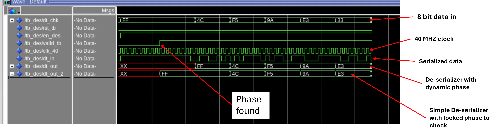

# VHDL_Verilog_simulation
## This will contain some examples of VHDL and Verilog simulation created

<ul>
<li>Verilog/ testbench.v contains the testbench framework for the simulation  
<li> Verilog/DES_40.v creates serializer block with 40 MHz sampling
<li> Verilog/DES_160.v is copy of DES_40.v for 160 MHz sampling 
<li> Verilog/sim.do is just a script to compile and run the simulation 
<li> Verilog/Ser.v serialize the 8 bit data into 1 bit signal at 40 MHz

<li>Verilogs/ testbench.v contains the testbench framework for the simulation
<li> Verilogs/DES_40.v creates serializer block with 40 MHz sampling
<li> Verilogs/DES_160.v is copy of DES_40.v for 160 MHz sampling
<li> Verilogs/sim.do is just a script to compile and run the simulation
<li> Verilogs/Ser.v serialize the 8 bit data into 1 bit signal at 40 MHz
 

</ul>

[Example output of first version of testbench](images/phase_detect_v1.png)

